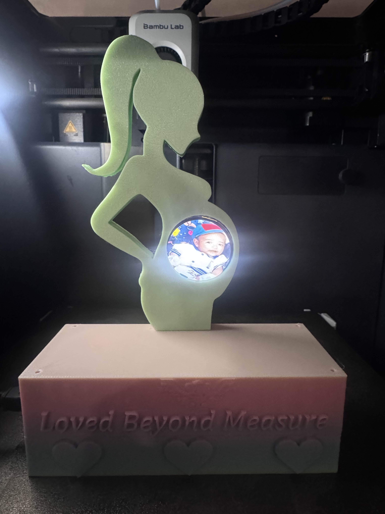
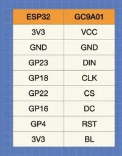

# Digital Ultrasound 
This frame is a tribute to a mother’s love  from the first heartbeat to every stage of life.

## Overview
**Digital Ultrasound** is a mini digital photo frame project that lovingly cycles from **the first heartbeat thru different stages of life** using an **ESP32** microcontroller and a **1.83\" GC9A01 round LCD**. Every image is a reminder that behind every growth stage is a mother who never stopped loving, protecting, and believing.

---

## 📸 Features
- Displays 7 rotating dog photos in full color.
- Round LCD screen gives a unique and cozy look.
- Custom 3D-printable case designed for tabletop display.
- Minimal hardware — just an ESP32, LCD, and M2 screws.

---

## 🧾 Bill of Materials (BOM)

| Item            | Description                          |
|-----------------|--------------------------------------|
| ESP32           | Any common dev board (e.g., WROOM32) |
| GC9A01 LCD      | 1.83" Round TFT Display              |
| M2 Screws       | For mounting case                    |
| 3D-Printed Case | STL files included in `example_photos/` |

---

## 🔌 Circuit Schematic

---

🖼️ Image Conversion Instructions

Follow the instructions in: instruction_photo_convert.txt

🖨️ 3D Printing Instructions
📁 STL Files

STL files are located here:
🔗 https://makerworld.com/en/@Warnoy25

📬 Contact
Want to showcase your own remix?
Let’s collaborate and make tech more lovable 

📧 aarongumba2016@gmail.com
